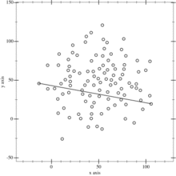

# Quickhull Algorithm

http://gameworksdocs.nvidia.com/PhysX/4.0/documentation/PhysXGuide/Manual/Geometry.html#quickhull-algorithm

>Quickhull Algorithm
This algorithm creates a convex mesh whose vertices are a subset of the original vertices, and the number of vertices is guaranteed to be no more than the specified maximum.

>The Quickhull algorithm performs these steps:

>- Cleans the vertices - removes duplicates etc.
>- Finds a subset of vertices, no more than vertexLimit, that enclose the input set.
>- If the vertexLimit is reached, expand the limited hull around the input vertices to ensure we encapsulate all the input vertices.
>- Compute a vertex map table. (Requires at least 3 neighbor polygons for each vertex.)
>- Checks the polygon data - verifies that all vertices are on or inside the hull, etc.
>- Computes mass and inertia tensor assuming density is 1.
>- Saves data to stream.

>When the hull is constructed each new vertex added must be further than PxCookingParams::planeTolerance from the hull, if not that vertex is dropped.


https://en.wikipedia.org/wiki/Quickhull

```
Input = a set S of n points 
Assume that there are at least 2 points in the input set S of points
QuickHull (S) 
{ 
    // Find convex hull from the set S of n points
    Convex Hull := {} 
    Find left and right most points, say A & B, and add A & B to convex hull 
    Segment AB divides the remaining (n-2) points into 2 groups S1 and S2 
        where S1 are points in S that are on the right side of the oriented line from A to B, 
        and S2 are points in S that are on the right side of the oriented line from B to A 
    FindHull (S1, A, B) 
    FindHull (S2, B, A) 
}
FindHull (Sk, P, Q) 
{ 
    // Find points on convex hull from the set Sk of points 
    // that are on the right side of the oriented line from P to Q
    If Sk has no point, then return. 
    From the given set of points in Sk, find farthest point, say C, from segment PQ 
    Add point C to convex hull at the location between P and Q 
    Three points P, Q, and C partition the remaining points of Sk into 3 subsets: S0, S1, and S2 
        where S0 are points inside triangle PCQ, S1 are points on the right side of the oriented 
        line from  P to C, and S2 are points on the right side of the oriented line from C to Q. 
    FindHull(S1, P, C) 
    FindHull(S2, C, Q) 
}
Output = Convex Hull
```

